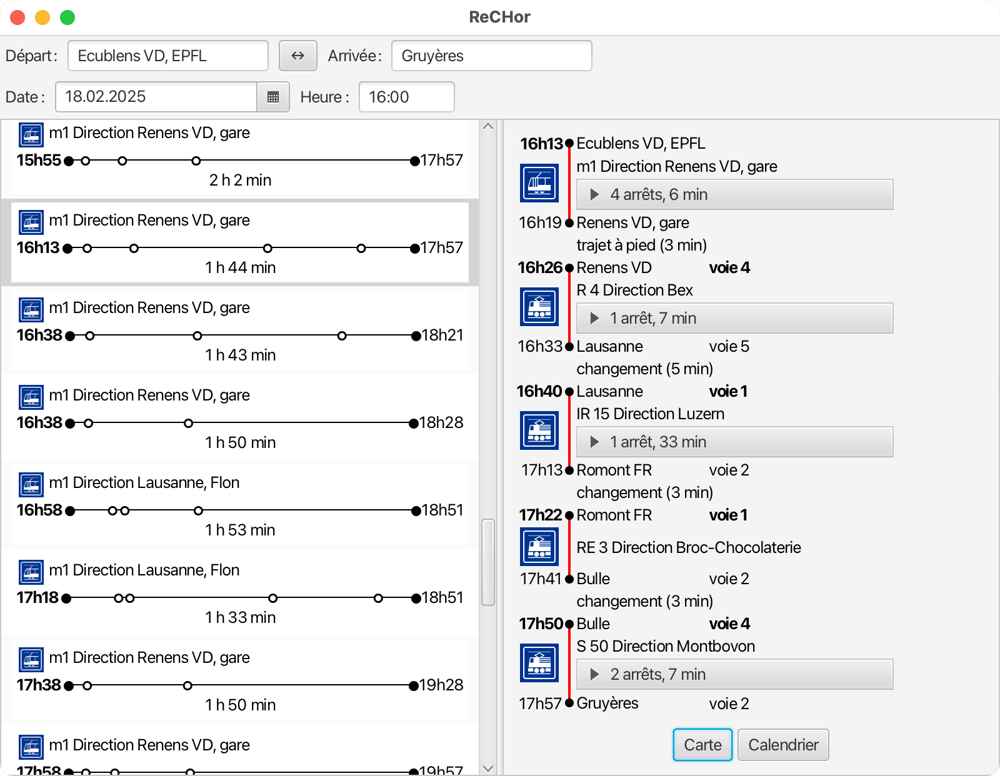
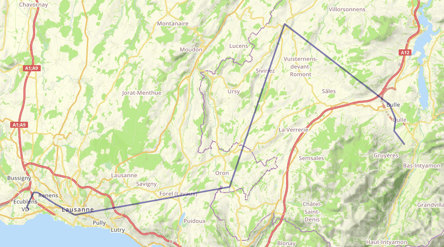
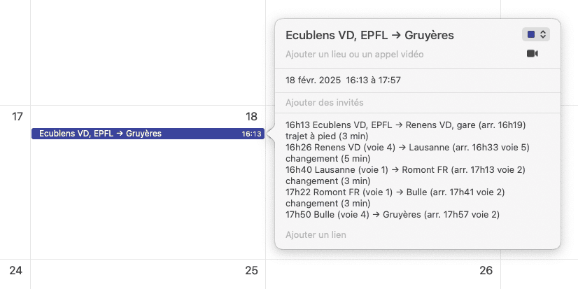

# ReCHor

Projet CS-108 — Recherche d’horaires de transport public en Suisse.

## Description

ReCHor est une application Java permettant de rechercher des trajets optimaux entre deux arrêts suisses, à une date et une heure données, sans connexion Internet (à partir de données horaires préalablement téléchargées).

Le projet applique une recherche **multi-critères** (notamment heure de départ/arrivée et nombre de changements) et retourne des relations **Pareto-optimales**.

## Introduction visuelle (énoncé du professeur)

### Figure 1 — Interface graphique de ReCHor

### Figure 2 — Relation visualisée sur uMap

### Figure 3 — Relation exportée dans un calendrier (iCalendar)

## Fonctionnalités implémentées

### 1) Recherche d’itinéraires

- Saisie d’un arrêt de départ et d’un arrêt d’arrivée.
- Sélection d’une date et d’une heure.
- Chargement des trajets proposés.

### 2) Horloge SBB / Stop2Go

Le code inclut une horloge SBB dédiée :

- composant `SBBClockNode` (fichier `src/ch/epfl/rechor/gui/SBBClockNode.java`),
- intégration dans l’interface de requête via `QueryUI`.

`SBBClockNode` mentionne explicitement :

- un cycle de trotteuse de type Stop2Go,
- une animation caractéristique de l’horloge CFF.

### 3) Navigation jour précédent / jour suivant

Dans `SummaryUI`, la liste des trajets inclut des boutons pour charger plus de résultats selon les jours :

- **Load Previous Day**
- **Load Next Day**

Ces boutons déclenchent le chargement de trajets pour `date - 1` ou `date + 1`.

## Technologies

- **Java** (principal)
- **JavaFX** pour l’interface graphique
- **CSS** pour le style

## Structure (aperçu)

- `src/ch/epfl/rechor/gui/` : composants d’interface (requête, résumé, horloge, etc.)
- `docs/images/` : captures d’écran utilisées dans le README
- Ressources CSS pour le styling des vues.

## Notes

Ce README résume à la fois la description officielle du projet et des extensions/fonctionnalités visibles dans le dépôt actuel (dont l’horloge Stop2Go et les boutons de navigation entre jours).
